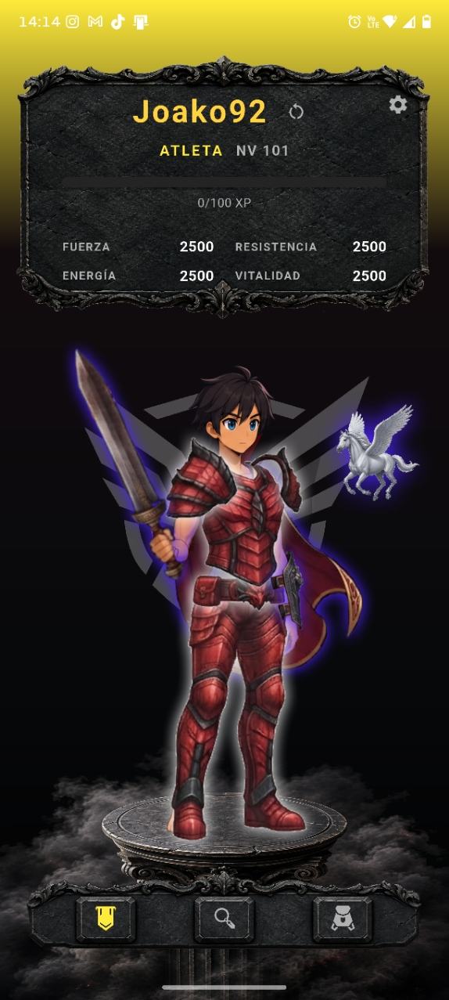
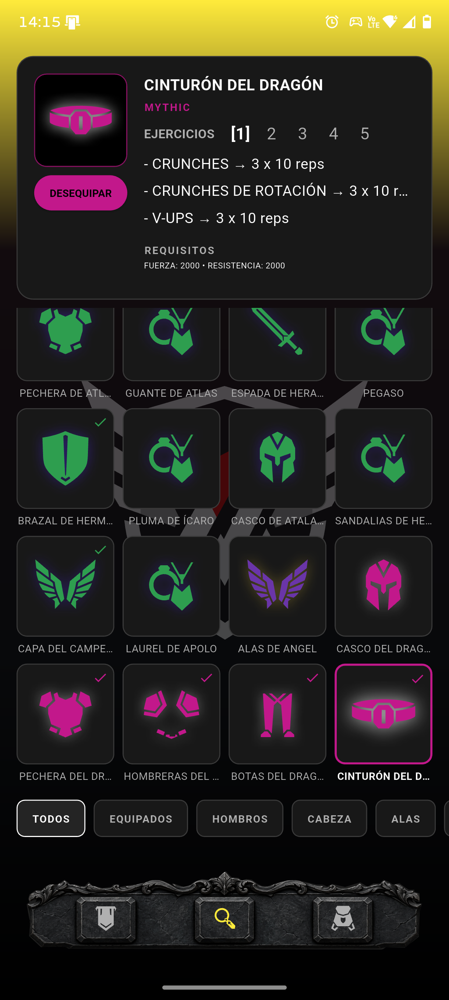
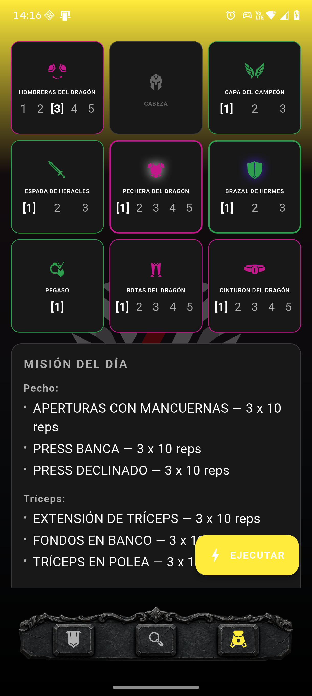

# VALQUIN

### Forge Yourself.

<p align="center">
  
  
  
</p>

> **Train in real life. Progress in the game. Forge Yourself.**

VALQUIN is a fitness RPG designed to turn real-life training into character progression.

The player trains in real life, completes exercises, earns progress, unlocks equipment and builds a character through a game-inspired progression system.

The visual direction follows a **dark mythic minimalism** approach:

> **The UI stays quiet. The world speaks through the assets.**

---

## Current Version

**v0.8.0 — Training History**

This release introduces a persistent training history system, allowing players to review their completed training sessions, the exercises performed, the selected exercise variants and the XP gained from each session.

### v0.8.0 Highlights

* Added persistent training session records.
* Added a training history system backed by SQLite and Drift.
* Added a `TrainingHistoryManager` to retrieve recent training records.
* Added a Training History dialog accessible from the player status card.
* Added an expandable list of the 10 most recent training sessions.
* Each session displays its completion date and total XP gained.
* Expanded sessions display the exercises performed and their recorded sets, repetitions or other measured amounts.
* Stored exercise IDs, selected variant indices and exercise details in the history.
* Recorded exercise details as snapshots so historical results remain independent of subsequent exercise definition changes.
* Recorded Strength, Endurance, Energy and Stamina gains for each completed session.
* Added a database migration for training history tables.
* Integrated training history recording into the training execution flow.

---

## Core Concept

VALQUIN connects four progression dimensions:

| Real Training        | Character Progression |
| -------------------- | --------------------- |
| Strength training    | Strength              |
| Sets and repetitions | Endurance             |
| Training duration    | Energy                |
| Aerobic capacity     | Stamina               |

Training determines progression, while equipment and character development provide the RPG layer.

---

## Current Gameplay Structure

### STATUS

The main character screen displays:

* Player information.
* Character statistics.
* Current equipment.
* Avatar.
* Equipment visual layers.
* Access to application settings.
* Access to the training history.

The avatar supports four views:

* Front
* Three-quarter
* Side
* Back

Equipment is rendered independently from the avatar, allowing individual items and visual layers to be combined dynamically.

### INVENTORY

The Inventory provides:

* Equipment browsing.
* Equipment filtering.
* Equipment details.
* Exercise variants.
* Unlock requirements.
* Equip requirements.
* Equipment statistics.
* Cooldown information.
* Equipment activation.

Equipment is organized by slots:

* Head
* Shoulders
* Wings
* Weapon
* Chest
* Shield
* Accessory
* Legs
* Belt

### EQUIPMENT

The Equipment system combines the selected equipment with the player's avatar through independent visual layers.

The Equipment screen also acts as the preparation stage for the player's daily training mission.

Players can:

* Activate equipment slots.
* Select exercise variants.
* Review the generated Daily Mission.
* View exercises grouped by muscle group.
* Execute the training session.

Special visual behavior includes:

* Wings rendered behind the character.
* Shields using view-specific layering.
* Accessories using independent animation.
* Rarity-based visual effects.

### TRAINING HISTORY

The Training History system records completed training sessions and makes them available from the player status card.

The dialog displays the 10 most recent sessions, ordered from newest to oldest.

Each session initially displays:

* Completion date.
* Total XP gained.

Selecting a session expands its details to display the exercises performed and their recorded sets, repetitions or other measured amounts.

Each training record includes the XP gained in the four progression attributes:

* Strength
* Endurance
* Energy
* Stamina

Exercise details are saved as historical snapshots. This preserves the recorded training results even if exercise definitions or available variants change in the future.

The history is stored locally in the application's SQLite database.

---

## Equipment Rarities

VALQUIN currently uses four equipment rarities:

| Rarity    | Visual Identity |
| --------- | --------------- |
| Common    | Gray / Blue     |
| Rare      | Green / Blue    |
| Legendary | Violet / Yellow |
| Mythic    | Fuchsia / White |

Rarity colors are independent from the application's user-selected accent color.

---

## Accessory Animation

Accessories can use an independent animated presentation.

The current animation system uses an eight-frame sequence:

```text
1 → 2 → 3 → 4 → 4 → 3 → 2 → 1
```

Accessory assets are stored independently from the avatar and equipment layers.

Current accessory concepts include:

* Weekly Logbook
* Atlas Gloves
* Pegasus
* Icarus Feather
* Hermes Sandals
* Apollo Laurel

Accessories can participate in the Equipment system without being assigned to a training muscle group.

---

## Visual Direction

VALQUIN follows a dark fantasy / mythological RPG aesthetic inspired by classic RPG interfaces and anime-style character progression.

The goal is not to reproduce a specific existing game, but to create an original visual identity combining:

* Dark backgrounds.
* Mythological themes.
* Minimal UI.
* Character-focused presentation.
* Game-inspired equipment.
* Strong visual assets.
* Subtle effects and animations.

The visual theme system expands this direction into two complementary environments:

* **Hades** — dark, imposing and shadow-focused.
* **Olympus** — open, celestial and sky-focused.

The underlying interface remains consistent while the world surrounding the player changes.

---

## Technical Architecture

VALQUIN is built with:

* **Flutter / Dart**
* **SQLite**
* **Drift**
* **Riverpod**

The project is progressively moving toward a modular architecture where:

```text
Screens
   ↓
Managers
   ↓
Models / Domain
   ↓
Persistence
```

UI components are progressively extracted from large screens into reusable widgets.

Visual configuration remains separated from domain models:

```text
Domain Models
    ↓
Visual Configuration
    ↓
Widgets / Renderers
```

This allows gameplay data to remain independent from visual presentation.

The `MuscleGroup` model follows the same principle by keeping training-domain relationships separate from screen presentation.

### Application Settings

Application settings are persisted through the database and currently include:

* Accent color.
* Language.
* Theme.

The theme system uses the `AppTheme` domain enum with:

```text
dark
light
```

Existing database records are migrated to the Dark theme by default.

### Training History Architecture

Training history is implemented through dedicated models, database tables and a manager:

* `TrainingRecord`
* `TrainingRecordExercise`
* `TrainingRecords`
* `TrainingRecordExercises`
* `TrainingHistoryManager`

A completed training session is stored as one training record, with its exercises stored as associated detail records.

The session record stores the completion timestamp and the XP gained in each attribute. Exercise records store the exercise ID, selected variant index, sets, amount and unit.

Historical exercise details are stored independently of the current exercise definitions, avoiding changes to previous records when exercise data evolves.

---

## Project Structure

The application is organized around several main areas:

```text
lib/
├── config/
├── database/
├── managers/
├── models/
├── persistence/
├── screens/
├── widgets/
└── ...
```

The architecture is being refined incrementally through vertical slices, keeping each change testable and isolated.

---

## Development Milestones

### v0.8.0

**Training History**

* Persistent training session records.
* Training history database tables.
* Database migration for training history.
* `TrainingHistoryManager`.
* Training session recording integrated into execution.
* XP gains recorded for all four attributes.
* Exercise and variant snapshots.
* Expandable Training History dialog.
* Display of the 10 most recent sessions.
* Exercise details with sets, repetitions and measured amounts.
* Training History access from the player status card.

### v0.7.8

**Hades & Olympus Theme System**

* Selectable Dark / Light themes.
* Hades dark visual environment.
* Olympus sky-blue visual environment.
* Persistent theme preference.
* Database migration for theme settings.
* English / Spanish theme localization.
* Dynamic Material theme switching.
* Olympus-specific background.
* Olympus-specific character environment.
* Bottom navigation background integration.
* Existing users default to Dark after migration.

### v0.7.7

**Daily Mission & Equipment Training Flow**

* Daily Mission system.
* Exercises grouped by muscle group.
* Centralized `MuscleGroup` domain model.
* Equipment slot → muscle group mapping.
* English / Spanish muscle group localization.
* Accessory exclusion from training groups.
* Daily Mission integration with selected exercise variants.
* Improved Equipment screen training presentation.
* Localized Execute / Ejecutar action.

### v0.7.6

**Welcome Flow Fix & Inventory Modularization**

* Welcome Screen bug fix.
* Inventory Screen decentralization.
* Inventory UI extraction into reusable widgets.
* Equipment visual mapping centralization.
* Inventory architecture cleanup.

### v0.7.5

**Equipment Visual Polish & Content Expansion**

* Equipment visual improvements.
* New equipment content.
* Expanded equipment sets and visual assets.

### v0.7.4

**Accessory Animation**

* Animated accessory system.
* Eight-frame accessory animation cycle.
* Accessory rendering separated from equipment layers.

### v0.7.3

**Avatar Customization & Onboarding**

* Welcome Screen.
* Player creation flow.
* Avatar selection.
* Persistent avatar selection.

### v0.7

**Avatar System**

* Four-view avatar system.
* Front / three-quarter / side / back rendering.
* Avatar persistence.

### v0.6.7

**Localization**

* English / Spanish localization system.

### v0.6.6

**Persistent Application Settings**

* Persistent application settings.
* Accent color persistence.
* Localization settings persistence.

### v0.6.3

**Custom Launcher**

* Custom VALQUIN launcher icon.

### v0.5.4

**Database-Driven Equipment & Exercises**

* Database-driven exercise system.
* Equipment data.
* Exercise variants.
* Requirements and progression data.

---

## Roadmap

### Next Step — Beta Preparation

The next development phase will focus on preparing VALQUIN for real-world testing.

Planned work includes:

* Beta APK preparation.
* Installation testing.
* Real-device testing.
* Gameplay validation.
* Bug collection.
* Balance adjustments.
* UX improvements based on testing.

The objective is to move from an increasingly complete development build toward a stable **private beta**.

---

## Philosophy

VALQUIN is built around a simple idea:

> **Training in real life should feel like progression in a game.**

The application should not replace discipline with gamification.

It should make discipline visible.

**Train. Progress. Forge Yourself.**
